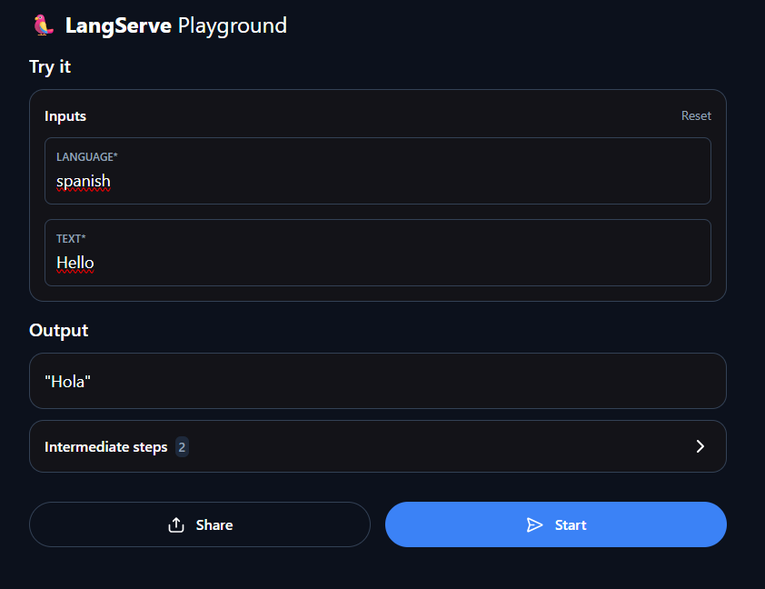

# Ollama Translation API

Bu proje, [Ollama](https://ollama.com)'nın `llama3.1:8b` modeli kullanılarak geliştirilen, metinleri farklı dillere çevirebilen bir çeviri API'sidir. FastAPI çatısı üzerinde kurulmuştur ve LangChain araçlarıyla entegre çalışır.

---

## Özellikler

-  Metinleri istenen dile çevirir  
-  REST API üzerinden erişim  
-  LangChain destekli zincir yapısı  
-  Ollama LLM modeli ile yüksek doğruluk  
-  Hızlı başlatılabilir yapı (`uvicorn` desteğiyle)

---

##  Kurulum

1. **Projeyi klonlayın:**

   ```bash
   git clone https://github.com/kullanici/ollama-translation-api.git
   cd ollama-translation-api
   ```

2. **Sanal ortam oluşturun ve aktif edin:**

   ```bash
   python -m venv venv
   source venv/bin/activate        # Linux / macOS
   venv\Scripts\activate         # Windows
   ```

3. **Gerekli paketleri yükleyin:**

   ```bash
   pip install -r requirements.txt
   ```

4. **Ortam değişkenlerini ayarlayın:**

   `.env` dosyasını oluşturup aşağıdaki anahtarları girin:

   ```env
   OLLAMA_API_KEY=...
   LANGCHAIN_API_KEY=...
   LANGCHAIN_TRACING_V2=true
   LANGCHAIN_PROJECT=LANGCHAIN_TRANSLATION
   ```

---

## Kullanım

Uygulamayı başlatmak için:

```bash
python main.py
```

veya doğrudan uvicorn kullanarak:

```bash
uvicorn main:app --host 0.0.0.0 --port 8000
```

---

## API Kullanımı

### Endpoint

- **POST** `/chain`  
  [http://localhost:8000/chain/playground/](http://localhost:8000/chain/playground/)

### İstek Örneği

```json
{
  "language": "turkish",
  "text": "Hello, how are you?"
}
```

### Yanıt

```json
"Merhaba, nasılsın?"
```

---

## Proje Yapısı

```
.
├── main.py                 # FastAPI uygulaması ve çeviri zinciri
├── requirements.txt        # Gerekli Python paketleri
├── .env                    # Ortam değişkenleri
└── langsmith.png           # Tanıtım görseli
```

---

## Kullanılan Teknolojiler

- [FastAPI](https://fastapi.tiangolo.com/)
- [LangChain](https://python.langchain.com/)
- [Ollama](https://ollama.com)
- [Uvicorn](https://www.uvicorn.org/)

---

## Görsel

<p align="center">
  
</p>
